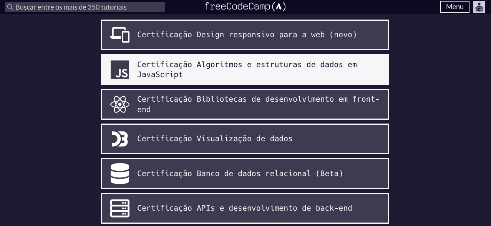

## Desafios da Certificação em Algoritmos e Estruturas de Dados em JavaScript - FreeCodeCamp Org

Certificação em Algoritmos e Estruturas de Dados em JavaScript

  

### Estude pela Freecodecamp e apoie este projeto:

https://www.freecodecamp.org/

### Conheça melhor o meu trabalho - Alex Gomes Linkedin!

https://www.linkedin.com/in/alexgomesnet/

### All Credits

https://github.com/freeCodeCamp/

### License:

[MIT](LICENSE)
